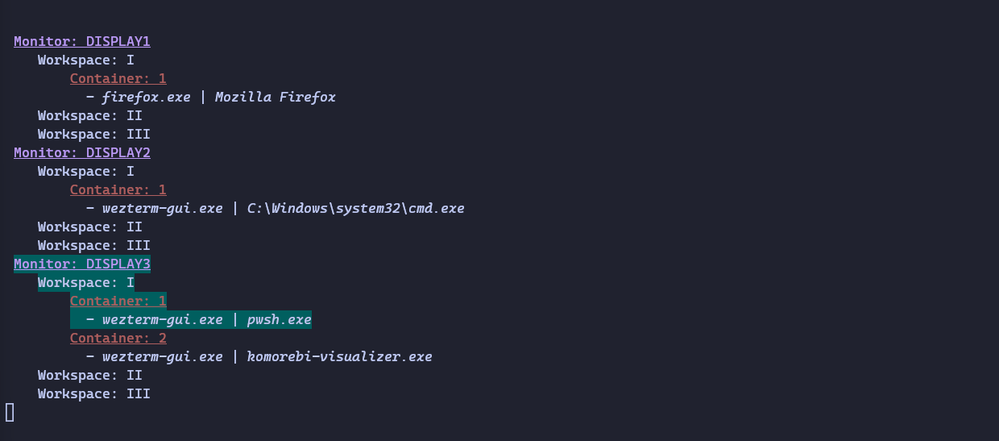

# komorebi-visualizer

Console application for Komorebi that shows what monitor, workspace, and container is currently selected, made to get my head around how Komorebi works.



```csharp
dotnet run
komorebic subscribe komorebi-pipe
```
